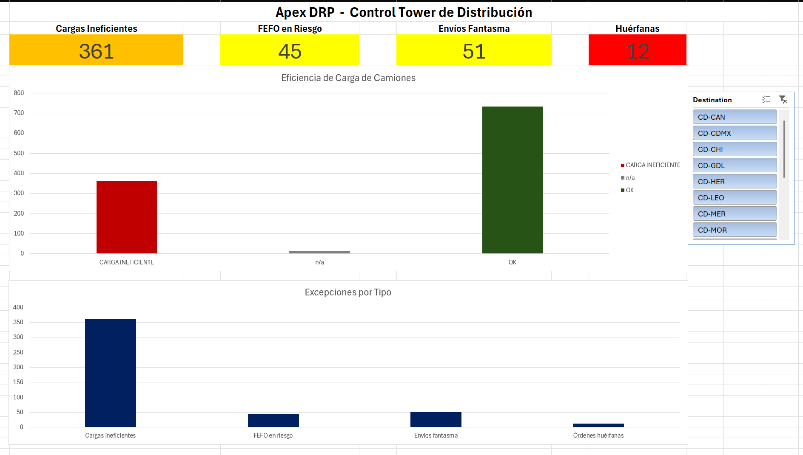

# Apex DRP Control Tower

**A distribution requirements planning (DRP) analytics engine built in Excel + Power Query over synthetic FMCG data.**

This project simulates the daily work of a Distribution / Supply Chain Analyst: it takes messy operational data from multiple sources, cleans and enriches it, computes DRP indicators (statistical safety stock, reorder points, in-transit coverage), flags the exceptions that require human action, decides how to fairly allocate scarce supply across distribution centers, and presents everything in an executive dashboard.

> Built as a portfolio piece. The goal was not to show a "nice spreadsheet" but to demonstrate the actual reasoning a distribution analyst applies every day — and to do it one level deeper than a typical entry-level candidate would.

---

## What this project demonstrates

| Skill area | Where it shows up |
|---|---|
| Data cleaning at scale | Power Query routines that turn 4 dirty CSVs into trusted tables, refreshable in one click |
| Lookups (VLOOKUP / XLOOKUP / INDEX-MATCH) | Used deliberately, each where it fits best (see docs) |
| Pivot tables, pivot charts, slicers | The executive dashboard |
| Statistical inventory theory | Safety stock with demand **and** lead-time variability; 95% service level |
| Exception logic | Four action flags, each with a business-justified threshold |
| Allocation under scarcity | Fair Share that auto-detects shortage SKUs and splits supply proportionally |
| Synthetic data engineering | A Python generator that seeds realistic, believable errors on purpose |

---

## The fictional company: Apex Consumer Goods

A mid-size Mexican FMCG distribution network:

- **3 plants** — Monterrey (PL-NTE), Mexico City (PL-CEN), Guadalajara (PL-SUR)
- **15 distribution centers** across the country
- **100 SKUs** in 5 categories, each with a distinct physical profile:
  - **Bebidas (BEB)** — heavy, fill a truck by *weight*
  - **Botanas (BOT)** — bulky but light, fill a truck by *space*
  - **Lácteos (LAC)** — perishable, drive the *FEFO* logic
  - **Abarrotes (ABA)** — long shelf life
  - **Promo (PRO)** — seasonal

*(Data values are kept in Spanish to simulate a real Mexican operation. All documentation is in English.)*

---

## Architecture: three layers

The model follows a strict logical boundary. This separation is the backbone of the whole project:

```
   RAW CSVs  ──►  POWER QUERY  ──►  EXCEL FORMULAS  ──►  DASHBOARD
   (dirty)       (clean +          (analyze:           (KPIs, charts,
                  enrich)           SS, flags,          slicers,
                                    fair share)         traffic lights)
```

- **Data layer (Power Query):** ingestion, cleaning, enrichment via merges and calculated columns. No copy-paste between sheets — everything stays a live, refreshable connection.
- **Analysis layer (Excel formulas):** the calculations that demonstrate spreadsheet skill — safety stock, fill rate, the exception flags, fair share.
- **Presentation layer (pivots + charts):** the executive dashboard.

> *"Power Query prepares the data, Excel analyzes it, the dashboard presents it."*

---

## The four exception flags (with justified thresholds)

A good flag fires on a **meaningful minority**. If it flags 80% of rows, it creates alert fatigue and nobody acts on it. Thresholds were calibrated, not guessed:

| Flag | Fires when | Threshold rationale | Count |
|---|---|---|---|
| **Inefficient Load** | Truck < 75% full | Industry standard for cost-effective freight; measured by the *greater* of weight-fill and space-fill | ~361 |
| **Stockout Risk** | On-hand + in-transit below reorder point | Reuses the DRP engine's `PEDIR YA` status — considers what's already on the way, avoiding false alarms | dozens |
| **FEFO Risk** | Dairy with < 70% shelf life remaining | The 30% consumed in transit is the margin a perishable needs to clear the rest of the chain before expiry | ~45 |
| **Ghost Shipment** | Still "In Transit" after > 5 days | Longest planned lane in the network is 5 days; beyond that, the truck stalled or SAP wasn't updated | ~51 |

Plus **12 orphan orders** (SKU codes that don't exist in the master — simulated SAP capture errors) detected via the merge.

---

## Fair Share Allocation

When a plant can't supply everything its DCs request, how do you split the shortage fairly?

The model runs across the **entire network** and **auto-detects** which SKUs are short. Where supply is sufficient, each DC gets what it asked for. Where it's short, each DC receives the **same proportion** of its request — sharing the scarcity equally rather than starving some DCs to fully serve others.

**Example (BOT-1019):** supply 4,509 units, total DC demand 9,278 → coverage ratio 0.486 → every DC receives 48.6% of what it requested. Allocations sum back to available supply.

**Headline KPI:** ~22,717 units of demand the network cannot fulfill due to supply shortage.

---

## Repository structure

```
apex-drp-control-tower/
├── README.md                        ← you are here
├── Apex_DRP_Model.xlsx              ← the working model (download to explore)
├── data/
│   ├── Master_Data_SKUs.csv         ← product master (dirty)
│   ├── Daily_Inventory_Forecast.csv ← inventory + forecast per DC (dirty)
│   ├── In_Transit_Orders.csv        ← in-transit orders (dirty)
│   └── Plant_Supply.csv             ← available plant supply (dirty)
├── src/
│   └── generate_apex_data.py        ← synthetic data generator (Python)
├── docs/
│   └── TECHNICAL_NOTES.md           ← formulas, decisions, and rationale
└── screenshots/
    └── dashboard.png                ← executive dashboard
```

---

## How to explore

1. **Quick look:** browse the dashboard screenshot below and skim this README.
2. **Technical detail:** read [`docs/TECHNICAL_NOTES.md`](docs/TECHNICAL_NOTES.md) for the formulas and the reasoning behind every decision.
3. **Hands-on:** download `Apex_DRP_Model.xlsx`. The data layer refreshes from the CSVs in `data/`.
4. **Regenerate the data:** run `python src/generate_apex_data.py` to reproduce the dirty CSVs (seeded scenarios are deterministic).

---

## Dashboard



KPIs with traffic-light coding, a truck-load efficiency chart, an exceptions-by-type chart, and a slicer to filter the whole view by distribution center.

---

## A note on the data

The CSVs are **intentionally dirty** — duplicates, nulls, inconsistent text, orphan codes, mixed values. Clean data demonstrates nothing; the cleaning routine is the point. Every error type was seeded on purpose to mirror what real SAP exports produce, and the model is built to handle them gracefully (no `#DIV/0!`, no `#N/A` leaking into the output).

---

## Tech stack

`Excel` · `Power Query (M)` · `Python (pandas, numpy)` · `Pivot Tables / Charts`
